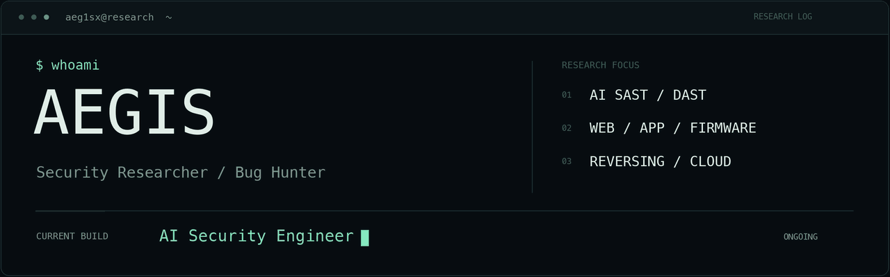

<picture>
  <source media="(prefers-reduced-motion: reduce)" srcset="assets/research-banner.png">
  
</picture>

 

I'm a **security researcher and bug hunter** working across web applications, mobile apps, firmware, software, and cloud environments. My work spans modern security engineering, security architecture design and review, and the use and development of security tools.

My current focus is **AI-assisted SAST/DAST and automated vulnerability assessment and validation**, as I adapt my research and engineering workflows to the AI era.

### Current research

- **AI SAST / DAST** — AI-assisted static and dynamic analysis, automated vulnerability assessment and validation, and security analysis workflows.
- **Bug hunting** — Ongoing vulnerability research across Apple products, a range of platforms, and open-source projects.
- **Web / Mobile / Firmware** — Web and mobile hacking, application and firmware analysis, software analysis, and reverse engineering.
- **Security engineering & architecture** — Security architecture design and review, modern security engineering practices, and cloud security.
- **Security tooling** — Using and integrating security tools, building analysis environments, and developing custom tooling for research and engineering.

### Building an AI Security Engineer

**Work in progress** · I'm building an AI Security Engineer to support vulnerability discovery, analysis, and validation.

The project brings together my research in AI-assisted SAST/DAST and automated assessment to explore how AI can carry out practical security engineering tasks.
