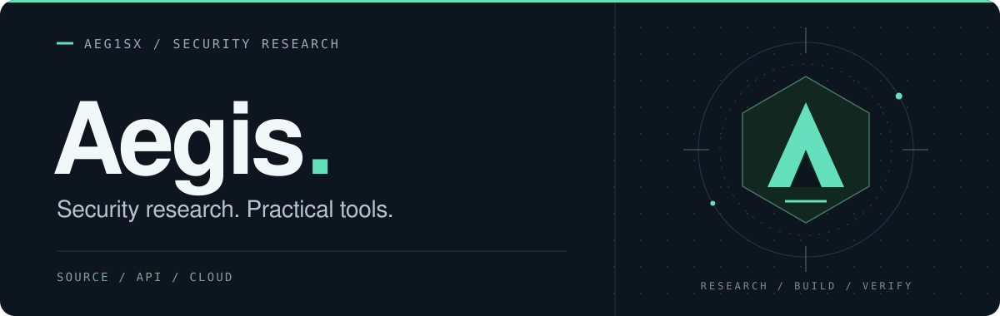

<picture>
  <source media="(prefers-color-scheme: dark)" srcset="assets/header-dark.svg">
  <source media="(prefers-color-scheme: light)" srcset="assets/header-light.svg">
  
</picture>

 

  <b>Hi, I'm David Han — Aegis.</b> 
  Vulnerability researcher building tools for code, APIs, and the cloud.

  <a href="https://github.com/Aeg1sx?tab=repositories">Explore my repositories</a>
  &nbsp; / &nbsp;
  <a href="https://github.com/Aeg1sx/Aegify/tree/main/docs">Aegify documentation</a>

 

### Selected work

| Project | Focus |
| :--- | :--- |
| **[Aegify](https://github.com/Aeg1sx/Aegify)** | Source security analysis with traceable evidence, optional AI review, and a team workspace. |
| **[IDOR Scout](https://github.com/Aeg1sx/idors-scout)** | API authorization testing with two-account validation and browser checks. |
| **[Cloud Security Tools](https://github.com/Aeg1sx/Cloud-Security-Tools)** | A collection of cloud security utilities, including GitHub Actions log export. |

### What I work on

- **Source code security** — connecting findings to the code and evidence behind them.
- **API authorization** — understanding access boundaries and validating results.
- **Security workflows** — making research repeatable with practical tooling.

 

  

  Read the code. Follow the evidence. Build something useful.

